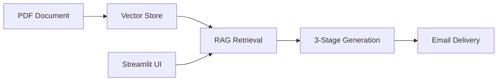

# Lecture Notes Generator - AI-Powered Assistant

An intelligent chatbot that generates professional lecture notes from PDF documents using RAG (Retrieval Augmented Generation) architecture, powered by Google Gemini LLM and LangGraph.

## 🎯 Features

- **PDF Document Processing**: Extracts and processes content from PDF files
- **Multi-Stage Generation Pipeline**: 
  - Initial answer generation
  - Answer refinement and improvement
  - Professional lecture notes formatting
- **Email Delivery**: Automatically sends generated notes via Gmail
- **Interactive Chat Interface**: Built with Streamlit for easy interaction
- **Evaluation System**: LangSmith integration for quality assessment

## 🏗️ Architecture



See [architecture.mmd](architecture.mmd) for detailed system architecture.

## 📋 Prerequisites

- Python 3.8+
- Google API Key (for Gemini)
- OpenAI API Key (for evaluation)
- LangSmith API Key (for evaluation)
- Gmail API credentials (credentials.json)

## 🚀 Installation

1. Clone the repository:

2. Create virtual environment:
```bash
python -m venv .venv
source .venv/bin/activate  # On Mac/Linux
```

3. Install dependencies:
```bash
pip install -r requirements.txt
```

4. Create `.env` file:
```env
MY_API_KEY=your_google_api_key
OpenAI_API=your_openai_api_key
LangChain_API=your_langsmith_api_key
```

5. Add Gmail credentials:
   - Place `credentials.json` in project root
   - Follow [Google Gmail API setup](https://developers.google.com/gmail/api/quickstart/python)

## 💻 Usage

### Running the Chatbot

```bash
streamlit run assistantMain.py -- --path_to_pdf "path/to/your.pdf" --email_to_send "recipient@example.com"
```

### Running Evaluation

```bash
python evaluator.py
```

This will:
- Load the test dataset from LangSmith
- Run evaluation on 3 test examples
- Assess relevance and clarity scores (1-5)
- Upload results to LangSmith platform

## 📁 Project Structure

```
ciklum_ai_academy_project/
├── agentProfessor.py       # Core agent logic (RAG + LangGraph)
├── assistantMain.py         # Streamlit UI application
├── evaluator.py             # Evaluation script
├── requirements.txt         # Python dependencies
├── architecture.mmd         # System architecture diagram
├── .env                     # Environment variables (create this)
├── credentials.json         # Gmail OAuth credentials (create this)
└── README.md               # This file
```

## 🔧 Components

### Core Agent (`agentProfessor.py`)
- **TextRetriever**: Custom retriever for vector similarity search
- **State**: TypedDict managing pipeline state
- **Pipeline Nodes**:
  1. `retrieve`: Get relevant document chunks
  2. `generate_basic`: Create initial answer
  3. `generate_middle`: Improve and refine
  4. `generate_final`: Format as lecture notes
  5. `post_message`: Send via Gmail

### Technologies Used
- **LangChain**: Framework for LLM applications
- **LangGraph**: State graph for multi-step workflows
- **Qdrant**: Vector database (in-memory)
- **HuggingFace**: Sentence transformers for embeddings
- **Google Gemini**: LLM (gemini-2.5-flash)
- **Streamlit**: Web UI framework
- **LangSmith**: Evaluation and monitoring

## 📊 Evaluation Metrics

The system is evaluated on:
- **Relevance** (1-5): How well the answer addresses the question
- **Clarity** (1-5): Professional quality and readability

Evaluation uses GPT-4o-mini as the judge LLM.

## 🔐 Security Notes

- Never commit `.env` or `credentials.json` to version control
- Keep API keys confidential
- Rotate credentials regularly

## 👥 Author

Yurii - Ciklum AI Academy Project

---

**Note**: This is an educational project demonstrating RAG architecture, LangGraph workflows, and LLM evaluation techniques.